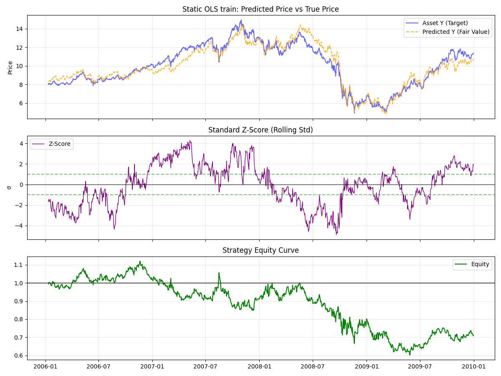
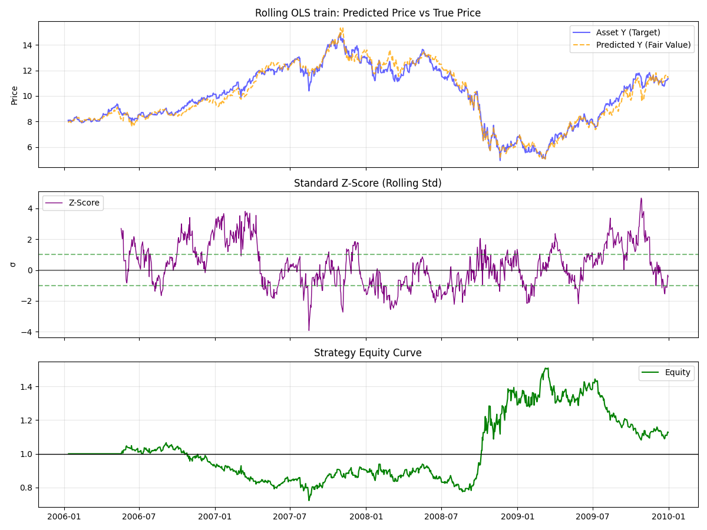
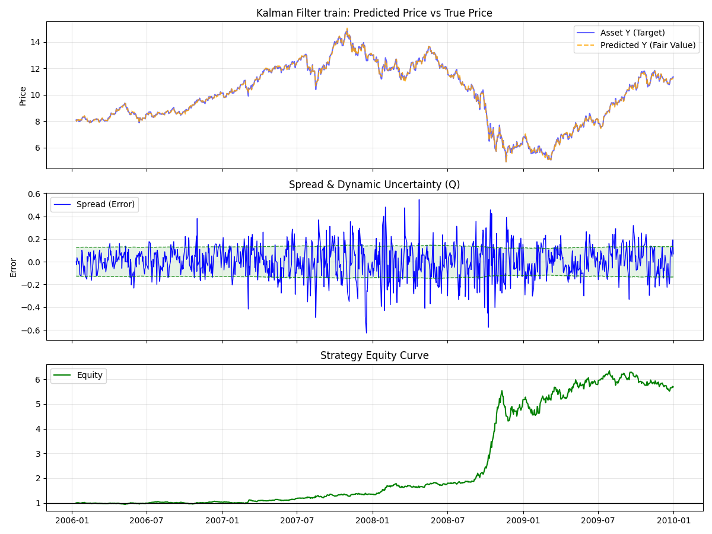
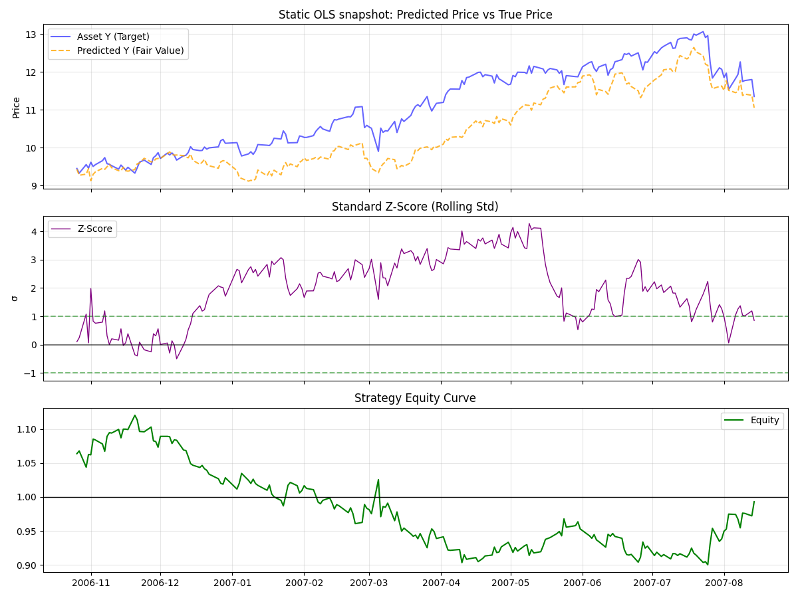
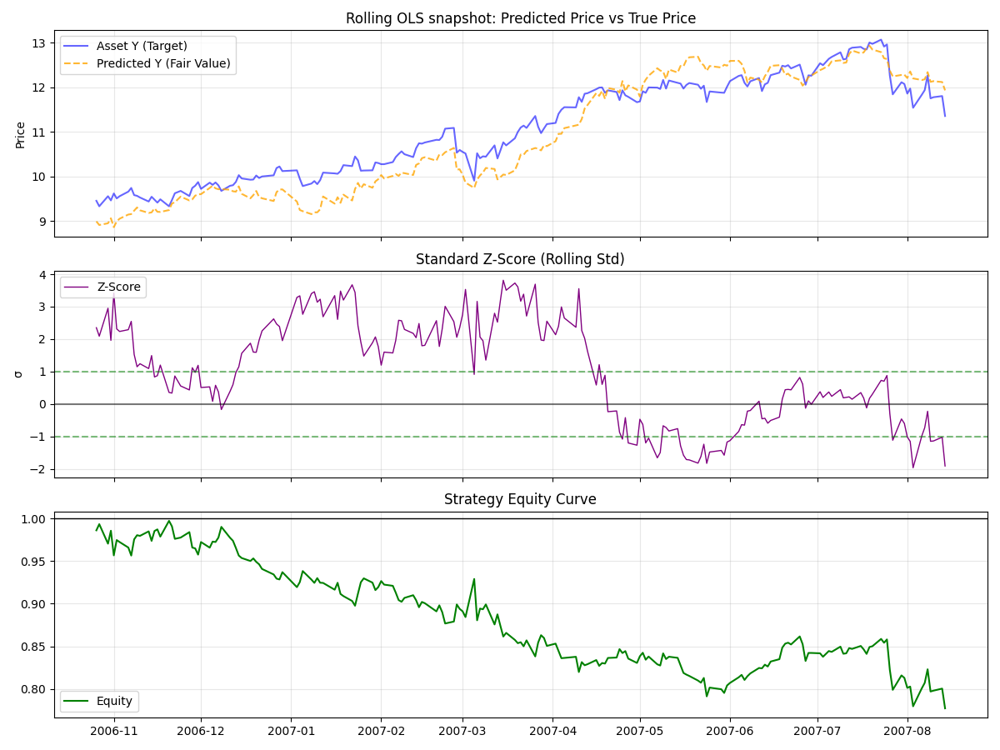
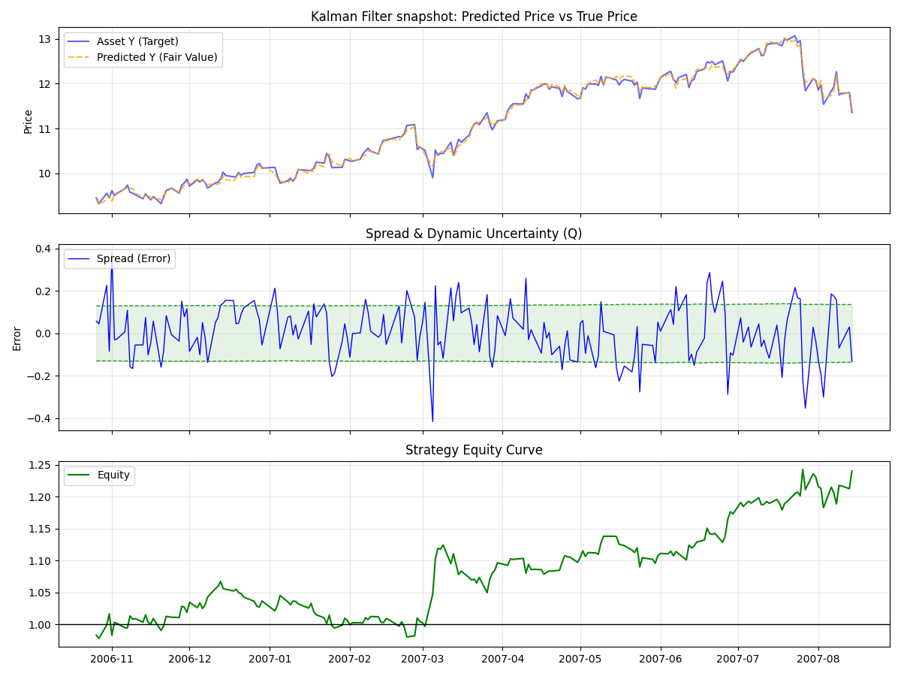
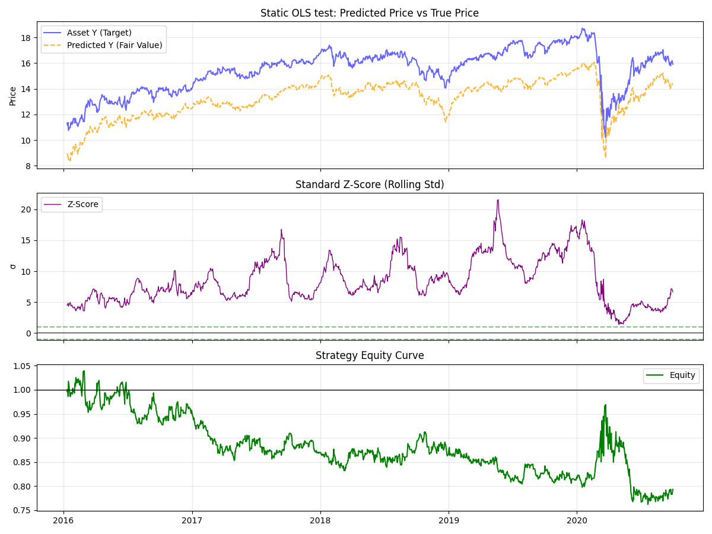
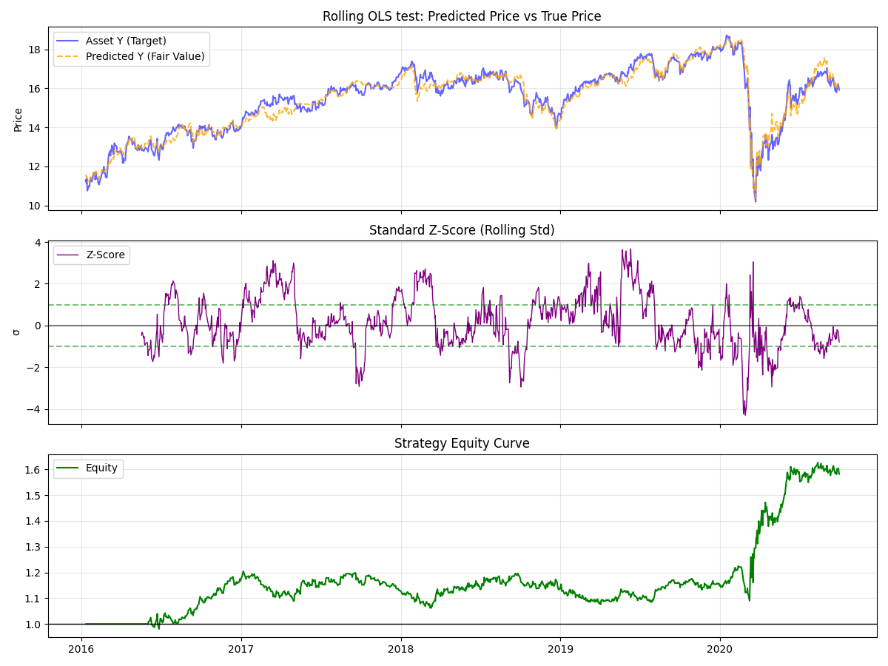
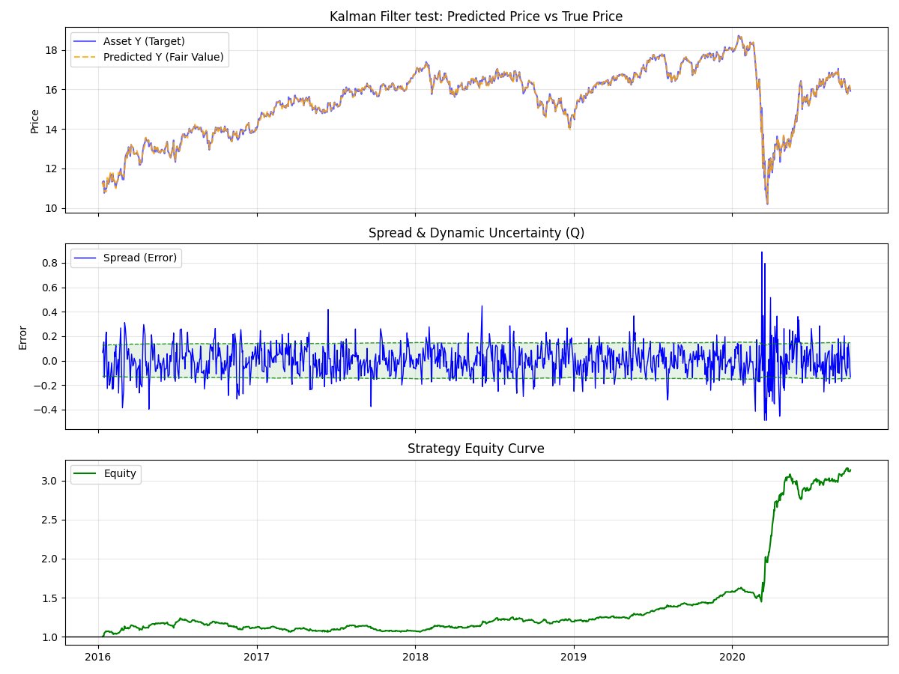
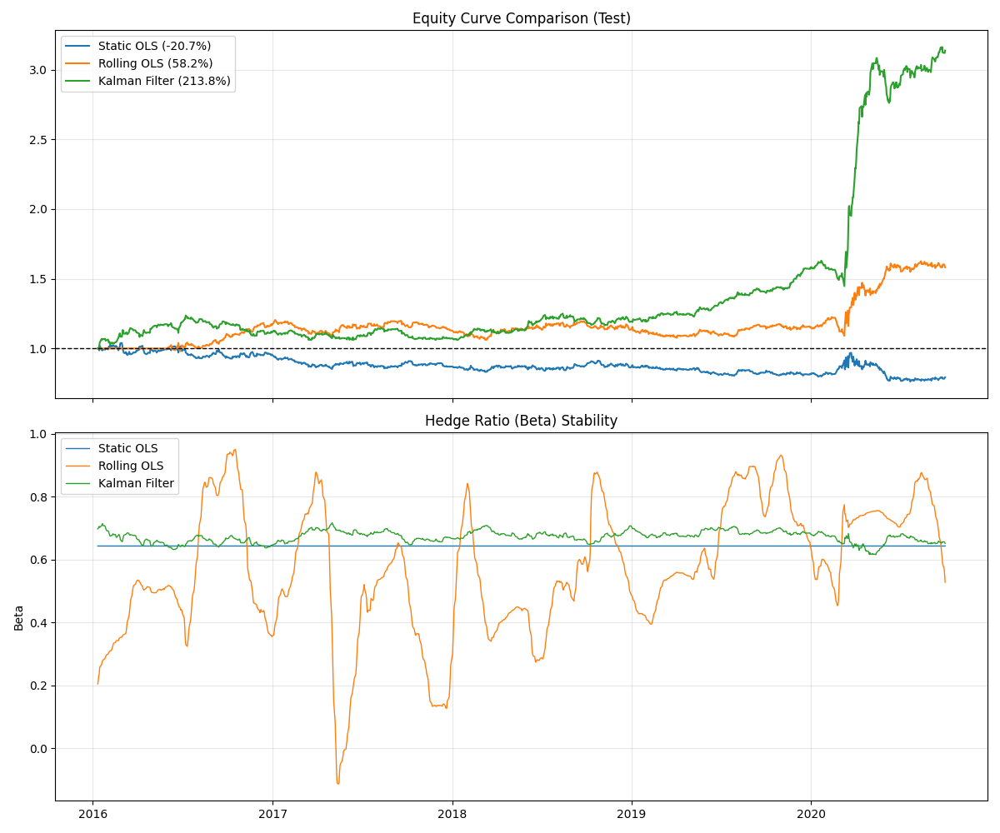

# Statistical Arbitrage Engine: From OLS to Kalman Filters


## 📖 Overview
This project is a modular Python framework for **Statistical Arbitrage (Pairs Trading)**. It is designed to test and visualize the evolution of mean-reversion strategies, moving from rigid assumptions to adaptive state-space models.

The core objective was to solve the **"Non-Stationarity Problem"**—the tendency of financial correlations to break down over time. The engine compares three distinct approaches:
1.  **Static Cointegration (OLS)**
2.  **Rolling Regression (Rolling OLS)**
3.  **Adaptive State-Space Models (Kalman Filter)**

## 🛠️ Tech Stack
* **Core Logic:** `Python`, `NumPy`, `Pandas`
* **Statistical & Math Libraries**: `Statsmodels`, Custom Kalman Filter
* **Visualization:** `Matplotlib`

## 💻 Installation
1. Clone the repository:
   ```bash
   git clone https://github.com/eddiesung111/statistical-arbitrage-engine.git
   ```
2. Create a virtual environment:
   ```bash
   python3 -m venv .venv
   source .venv/bin/activate
   ```
3. Install dependencies:
   ```bash
   pip install -r requirements.txt
   ```

## 🚀 Usage
1. Run the Analysis
To run the full backtest comparison (OLS vs. Rolling OLS vs. Kalman) on the default pair (EWC/EWA):
```Bash
python main.py
```
This will generate 8 diagnostic plots and 3 snapshots in the `results/` folder.

2. Parameter Optimization
To find the optimal Process Noise ($\delta$) and Measurement Noise ($Ve$) for the Kalman Filter:
```Bash
python optimize_kalman.py
```

## 🧠 Methodology and Trading Logic
### Cointegration Screening (The Foundation)
   Before implementing any trading strategy, we first validated that the asset pair (EWC vs. EWA) exhibits a fundamental long-term equilibrium. Unlike simple correlation, which merely measures directional alignment, Cointegration implies that the linear combination of two non-stationary time series results in a stationary series (one with constant mean and variance).
   We utilized the Engle-Granger Two-Step Method:
   1. Regression: We performed a linear regression of Asset $Y$ on Asset $X$ to find the spread: $\epsilon_t = Y_t - \beta X_t$.
   2. Stationarity Test: We applied the Augmented Dickey-Fuller (ADF) test on the residuals $\epsilon_t$.
      -- Criterion: A p-value $< 0.05$ rejects the null hypothesis of a unit root, confirming the pair is mean-reverting.


### Strategy Engines
We implemented three distinct engines to calculate the hedge ratio ($\beta$) and the resulting spread.

#### Static OLS (Baseline)
This method assumes the relationship between the assets is constant forever.
- **Training Phase (In-Sample)**: We calculate a single $\beta$ using Ordinary Least Squares on the entire training dataset (2005–2010).
- **Look-Ahead Bias**: It is important to note that the training performance contains inherent look-ahead bias, as the $\beta$ used on Day 1 was derived knowing the prices on Day 1,000.
- **Testing Phase (Out-of-Sample)**: We "lock" this specific $\beta$ and apply it blindly to the test set (2015–2020). This tests whether historical correlations hold over decade-long horizons.

#### Rolling OLS (Intermediate)
To mitigate the rigidity of the Static model, this method recalculates $\beta$ daily using a rolling lookback window (e.g., 90 days).
- **Mechanism**: On day $t$, the model performs a regression using data from $t-90$ to $t-1$.
- **Trade-off**: While more adaptive than Static OLS, it suffers from "lag." If the market regime shifts effectively, the Rolling OLS takes a full window length to fully adjust to the new reality.


#### Kalman Filter (Adaptive)
We implemented a probabilistic State-Space model where the hedge ratio $\beta_t$ is treated as a hidden state that evolves over time.
- **Observation Equation**: $Y_t = \beta_t X_t + \epsilon_t$
- **State Equation**: $\beta_t = \beta_{t-1} + \omega_t$
- **Adaptation**: Unlike Rolling OLS, the Kalman Filter updates its estimate instantaneously upon receiving new price data. It also calculates the prediction error covariance ($Q_t$), allowing us to construct dynamic volatility bands that expand during market uncertainty and contract during calm periods.

### Signal Generation & Execution Logic

#### Vectorized Signal Calculation
To ensure high-performance backtesting and reproducibility, we utilized Vectorized Logic rather than iterative "event-driven" loops (one-position-at-a-time logic).
- **Why**: Iterative loops that check if current_position == 0 can be slow and prone to path-dependence errors.
- **Implementation**: We calculate the signals with the logic we have mentioned above at once. The target position is determined purely by the current signal. This means the strategy effectively "refreshes" its position sizing daily based on the signal strength, rather than waiting for a distinct "exit" event before re-evaluating.

#### Transaction Costs
Realism was enforced by applying transaction costs to every turnover of the portfolio.
- **Cost Model**: We deducted basis points (bps) from the strategy return whenever the position changed (e.g., flipping from Long to Short incurs a cost on the full notional value).


### Strategy Behavior & Logic
To understand how the three models differ, we analyze their behavior on the Training Set (2005-2010). This period covers the 2008 Financial Crisis, providing a perfect stress test for strategy adaptation.

#### Visual Diagnostics (The "Macro" View)
Comparing how the models track "Fair Value" and generate signals.

<table width="100%">
  <tr><td width="33%" valign="top"><div align="center">
  
  <b>1. Static OLS</b></div><b>The "Rigid" Model</b>
  <small>Because the hedge ratio is fixed for 5 years, the "Predicted Price" (Gold) fails to adapt to structural breaks. The Z-score becomes extremely volatile because a single $\beta$ cannot fit both 2005 and 2009 market regimes.</small>
  </td><td width="33%" valign="top"><div align="center">
  
  <b>2. Rolling OLS</b></div><b>The "Over-Reactive" Model</b>
  <small>The model adjusts, but it lacks memory. It "chases" the market, treating noise as signal. Notice how the Z-score is erratic—it adapts so quickly that it often eliminates the very mean-reversion opportunity we are trying to trade.</small> 
  </td> <td width="33%" valign="top"> <div align="center"><b>3. Kalman Filter</b></div>
  
  <b>3. Kalman Filter</b></div><b>The "Balanced" Model</b>
  <small>The Kalman Filter balances <i>new data</i> against <i>prior belief</i>. The predicted price tracks the true price closely, but unlike Rolling OLS, it doesn't overreact. This results in cleaner entry signals (Blue Line crossing Green Bands).</small> 
  </td>
  
  </tr>
</table>

#### In-Sample Performance & Hedge Ratio Analysis
Why did Kalman Filter outperform so significantly compared to Static OLS?

**The stability of the hedge ratio:**
- **Static OLS (Blue Line)**: The flat line ($\approx 0.64$) is a "statistically average" fit for the whole 5 years. It fails because the true relationship between EWC and EWA is dynamic.
- **Rolling OLS (Orange Line)**: Extremely volatile, swinging from 0.3 to 1.1. It suffers from "Recency Bias"—it completely forgets historical data and overfits to the last 90 days of noise. This causes it to enter trades with the wrong hedge size.
- **Kalman Filter (Green Line)**: The "Balanced" model. It varies smoothly between 0.5 and 0.65. It acknowledges that the relationship is changing, but it treats sudden spikes as noise (Measurement Error) rather than structural shifts.

**The Equity Curve Analysis:**
- **The 2008 Crisis**: Notice the massive divergence in 2008. The Static OLS (Blue) collapses because the historical correlation broke. The Rolling OLS (Orange) survives (+12.8%) but died out because of volatility.
- **The Kalman Advantage**: The Kalman Filter (Green) identified the trend shift early but remained stable. It captured the massive volatility of the crisis as profit, generating a 469.3% return, proving that "Adaptive but Stable" is the superior approach to mean reversion.

#### Execution Mechanics (Micro View)
A 200-day snapshot showing the exact entry and exit logic.

**Trading Logic Steps:**
1. **Entry**: When the Spread (Blue) crosses the Upper Band (Green), the strategy detects a deviation. The Position (Dotted Line) flips to -1 (Short).
2. **Holding**: We hold the position as long as the spread remains disjointed.
3. **Exit**: As the spread collapses back toward 0 (Mean Reversion), the position is closed.
4. **Result**: The Cumulative Profit (Gold) steps up as the trade converges.

<table width="100%"> <tr> <td width="33%" align="center"> <b>Static OLS Snapshot</b>

 </td> <td width="33%" align="center"> <b>Rolling OLS Snapshot</b>

 </td> <td width="33%" align="center"> <b>Kalman Filter Snapshot</b>

 </td> </tr> </table>

### Visualization & Results (Out-of-Sample)
The true test of any quantitative strategy is its performance on unseen data. The following results reflect the strategies' performance on the Test Set (2015–2020), a period completely excluded from the optimization process.

#### Strategy Performance Charts (Test Set)
Visualizing how each engine navigated the 2015-2020 market regime.

<table width="100%"> <tr> <td width="33%" align="center"> <b>1. Static OLS</b>



<i>(Flatline: The fixed spread never crossed the threshold)</i> </td> <td width="33%" align="center"> <b>2. Rolling OLS</b>



<i>(Moderate growth, but choppier equity curve)</i> </td> <td width="33%" align="center"> <b>3. Kalman Filter</b>



<i>(Consistent Alpha generation with lower volatility)</i> </td> </tr> </table>

#### Comparative Analysis
<div align="center">  </div>

**Performance Metrics Summary**
| Strategy | Total Trades | Annual Return | Sharpe Ratio | Max Drawdown | Verdict |
| :--- | :--- | :--- | :--- | :--- | :--- |
| **Static OLS** | 0 | -4.78% | -0.22 | -26.66% | The strategy failed completely The fixed parameters from 2005 were irrelevant in 2015. |
| **Rolling OLS** | 76 | 10.20% | 0.72 | -11.80% | It remained profitable, but the adaption to the market noise limited its ability to capture sharp reversions, resulting in a mediocre Sharpe ratio.  |
| **Kalman Filter** | **201** | **27.41%** | **1.65** | **-14.27%** | High trade frequency combined with a high Sharpe ratio indicates the model successfully identified true signals while filtering noise. |

#### Optimization & Robustness Check
How we avoided overfitting during the parameter tuning process.

For the Kalman Filter, we optimized the Measurement Noise ($Ve$) and Process Noise ($\delta$) using the Training Set. We evaluated two competing parameter sets:
- **Fixed Parameters**: Window = 90 days, Entry Threshold = 1.0, Exit Threshold = 0.1.
- **Competing Candidates for $Ve$ and $\delta$:**

| Candidate | Parameters | **Train** Return | **Train** Sharpe | **Train** Drawdown | Selection Logic |
| :--- | :--- | :--- | :--- | :--- | :--- |
| **Aggressive** | $Ve=10^{-3}, \delta=10^{-5}$ | **61.10%** | **1.87** | -29.95% | Highest return, but deep drawdown implies overfitting to specific noise. |
| **Robust (Selected)** | $Ve=10^{-2}, \delta=10^{-5}$ | 54.98% | 1.77 | **-22.24%** | Slightly lower return, but significantly safer drawdown profile. |

**The "Out-of-Sample" Validation**: When we applied these candidates to the unseen Test Data, the importance of prioritizing Drawdown over Return became obvious:
- **The Aggressive Set** ($Ve=10^{-3}$) collapsed in the test phase. Its Sharpe Ratio plummeted from 1.87 $\to$ 0.77, and returns dropped to 11.41%. It was overfitted to the training data.
- **The Robust Set** ($Ve=10^{-2}$) held its ground. Its Sharpe Ratio remained stable (1.77 $\to$ 1.65), and it delivered a strong 27.41% return.
**Conclusion**: By selecting parameters based on stability (Max Drawdown) rather than raw profit, we successfully filtered out noise and built a strategy that generalizes to the future.

## 📂 Project Structure
```text
Project_Root/
│
├── main.py              # Master script: Runs Train/Test analysis & generates plots
├── optimize_kalman.py   # Grid Search optimizer for Kalman parameters (Ve, Delta)
├── requirements.txt     # Dependencies
├── README.md            # Project Documentation
│
├── results/             # Generated plots (Equity curves, Spread analysis)
│
└── src/                 # Logic Core
    ├── __init__.py
    ├── backtesting.py   # PnL engine & Performance metrics
    ├── data_loader.py   # Yahoo Finance data fetching & cleaning
    ├── screening.py     # Cointegration tests (Engel-Granger) to find pairs
    ├── strategies.py    # Math logic (OLS, Rolling, Kalman)
    └── visualization.py # Plotting engine (Dynamic Bands, Equity Curves)
```

## 🔮 Future Improvements
While the current Kalman Filter implementation outperforms OLS, several enhancements could push this project further:

1.  **Dynamic Position Sizing (Kelly Criterion):** Currently, the strategy uses fixed capital allocation. Implementing a fractional Kelly Criterion based on the Kalman Filter's variance estimate ($Q_t$) could optimize leverage dynamically.
2.  **Slippage Modeling:** The current backtest assumes execution at the close price. Adding a slippage model based on ATR (Average True Range) would increase realism.
3.  **Multivariate Kalman Filter:** Extending the model to trade a basket of assets (e.g., one ETF vs. a basket of 3 sector ETFs) using a multidimensional state vector.

## 📚 References
* **Chan, E. (2013).** *Algorithmic Trading: Winning Strategies and Their Rationale.* (Source of the Kalman Filter logic for mean reversion).
* **Kalman, R. E. (1960).** *A New Approach to Linear Filtering and Prediction Problems.*

## 📄 License
This project is licensed under the MIT License - see the LICENSE file for details
